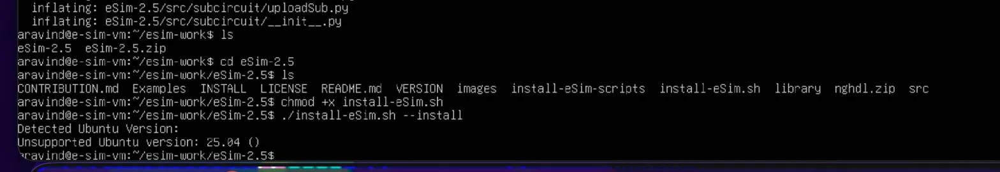
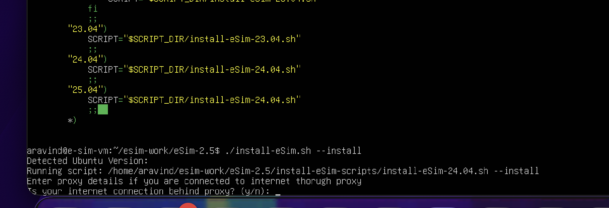
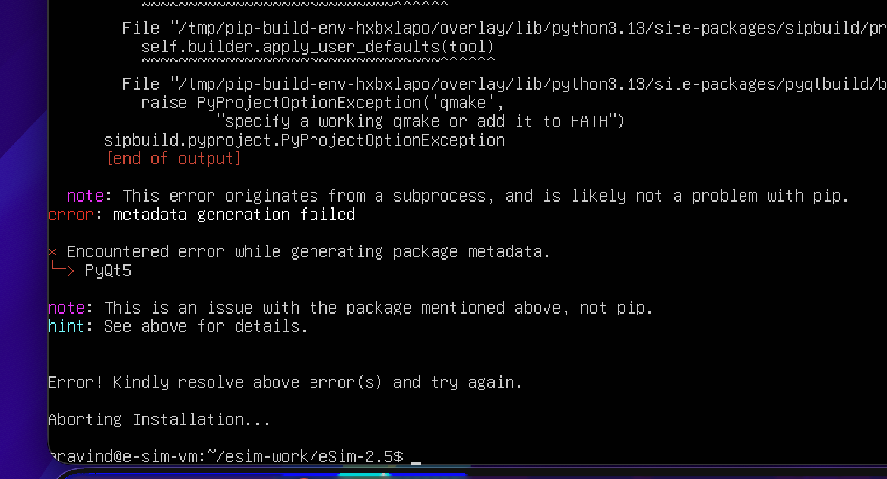
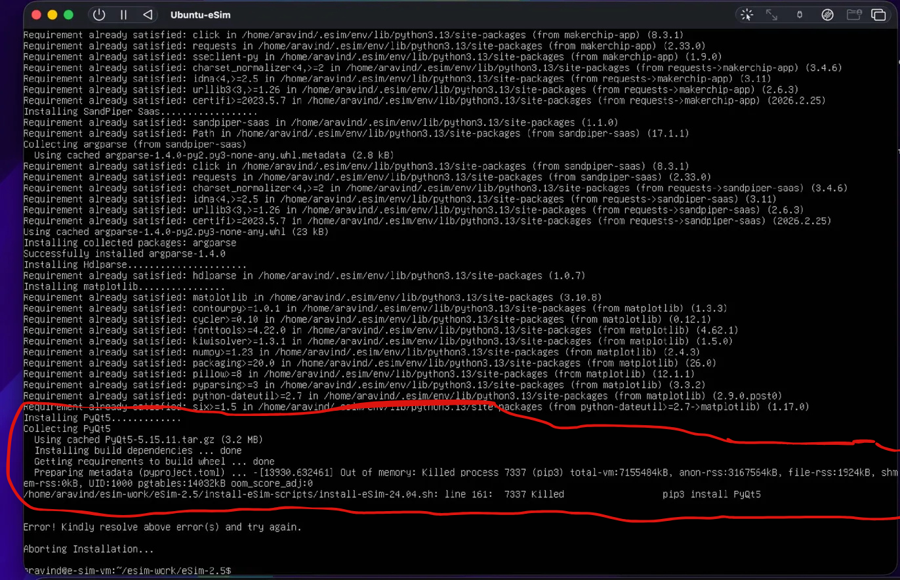
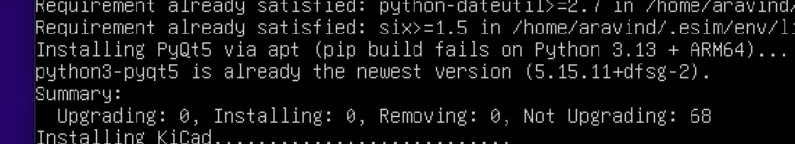
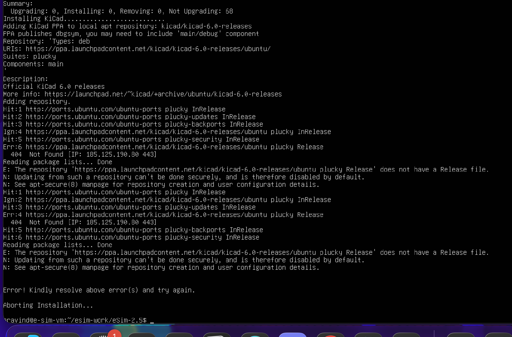
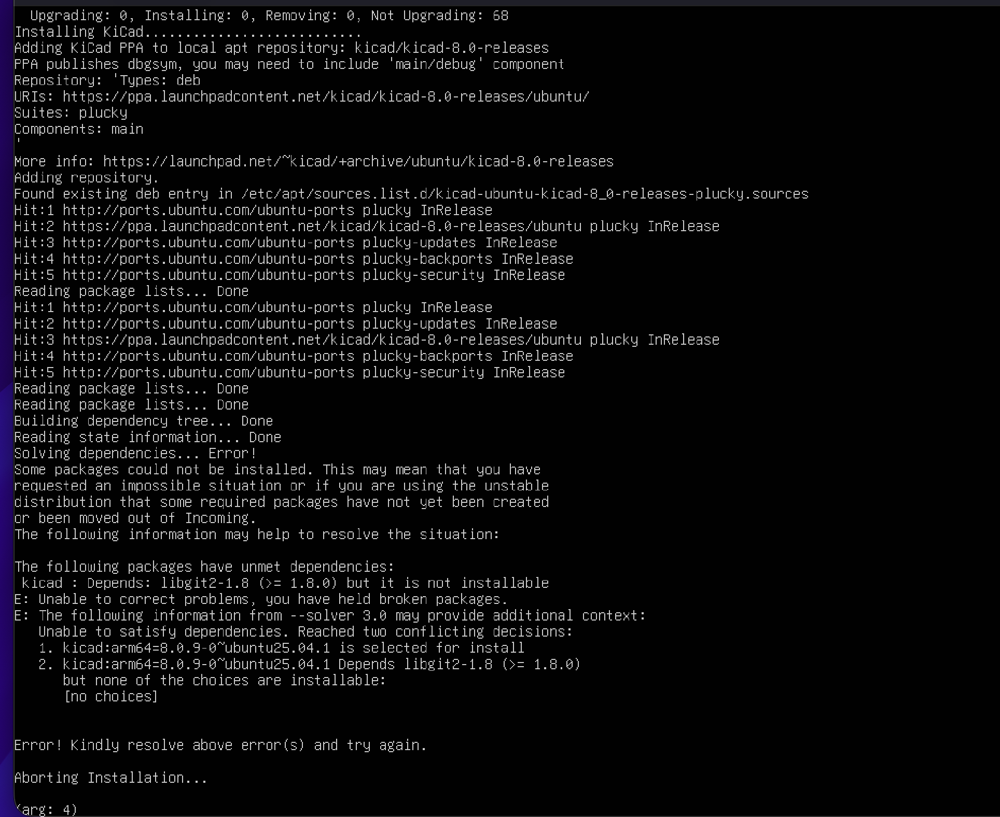
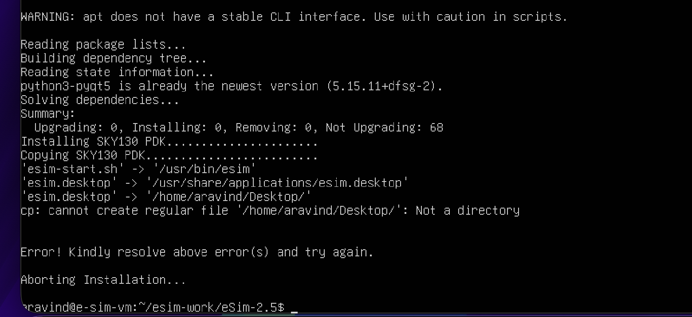
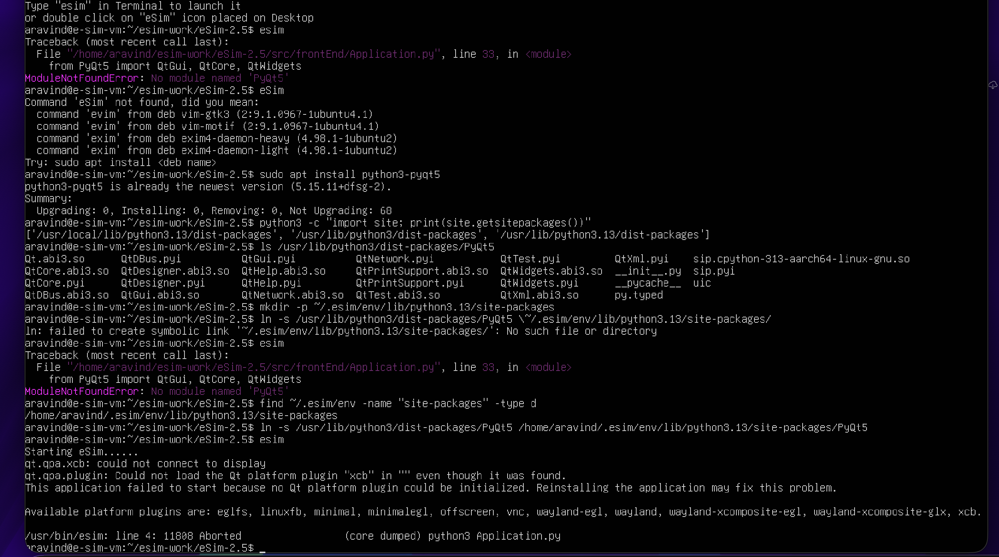

# eSim 2.5 Installation Debug Report
### eSim Summer Fellowship 2026 — Task 4 Submission
**Author:** Gm Aravind (gmarav05) | **Date:** 29–30 March 2026

---

## 1. Environment

| Parameter | Details |
|-----------|---------|
| Host Machine | MacBook (Apple Silicon - ARM64) |
| VM Software | UTM (QEMU) |
| Guest OS | Ubuntu 25.04 (Plucky Puffin) - ARM64 |
| eSim Version | 2.5 |
| Python Version | 3.13 (default on Ubuntu 25.04) |
| RAM | 4 GB (VM) |
| Storage | 64 GB (VM) |

> **Note on Architecture:** This testing was done on ARM64 (Apple Silicon via UTM/QEMU).
> Some issues (OOM during PyQt5 build) may not reproduce on x86_64 systems if pre-built
> PyQt5 wheels are available for that platform. Issues 1, 2, 4, 5 and 6 are
> architecture-independent and will affect any Ubuntu 25.04 installation.

---

## 2. Objective

To download and install eSim 2.5 on Ubuntu 25.04 (Plucky Puffin), identify all
dependency and compatibility issues in the installation scripts, attempt fixes where
possible and produce a well-documented report of findings.

---

## 3. Setup & Methodology

### 3.1 Environment Setup
1. Installed UTM on macOS (Apple Silicon compatible VM software)
2. Created VM: 4GB RAM, 2 CPU cores, 64GB storage, Ubuntu 25.04 ARM64 server ISO
3. Installed base dependencies: `sudo apt install -y git wget curl unzip`
4. Downloaded eSim-2.5.zip from `static.fossee.in` (96.2 MB)
5. Extracted and attempted installation: `bash install-eSim.sh --install`

### 3.2 Debugging Approach
- Ran installer with output captured: `bash install-eSim.sh --install 2>&1 | tee install_log.txt`
- Analyzed each error, identified root cause before applying any fix
- Applied minimal targeted patches — only changed what was necessary
- Commented out blocking sections (per task instructions) to continue past unfixable issues
- Re-ran installer after each fix to verify and discover next issue

---

## 4. Issues Found & Fixed

### Issue 1 (Critical): Ubuntu 25.04 Not Recognised by `install-eSim.sh`

**Location:** `install-eSim.sh` → `run_version_script()` function

**Error:**
```
Detected Ubuntu Version:
Unsupported Ubuntu version: 25.04 ()
```

### Screenshot



**Root Cause:**
The `install-eSim.sh` script uses a `case` statement to route to a version-specific
installer script. It only handles versions 22.04, 23.04 and 24.04. Ubuntu 25.04
hits the wildcard `*` branch and immediately calls `exit 1`, blocking the entire
installation before a single dependency is installed.

A secondary bug was also observed: `Detected Ubuntu Version:` prints blank. This is
because `lsb_release -d` on Ubuntu 25.04 returns a string that does not match the
`\d+\.\d+\.\d+` regex pattern used in `get_ubuntu_version()`, so `$FULL_VERSION`
is always empty on 25.04.

```bash
# Original code — install-eSim.sh
case $VERSION_ID in
    "22.04") ... ;;
    "23.04") ... ;;
    "24.04") ... ;;
    *)
        echo "Unsupported Ubuntu version: $VERSION_ID ($FULL_VERSION)"
        exit 1   # <-- entire installation blocked on Ubuntu 25.04
        ;;
esac
```

**Fix Applied:**
Added a `25.04` case falling back to the 24.04 installer, since Ubuntu 25.04 is the
immediate successor and shares the majority of its package ecosystem with 24.04.

```bash
# Fixed code — install-eSim.sh
"24.04")
    SCRIPT="$SCRIPT_DIR/install-eSim-24.04.sh"
    ;;
"25.04")
    SCRIPT="$SCRIPT_DIR/install-eSim-24.04.sh"
    ;;
*)
    echo "Unsupported Ubuntu version: $VERSION_ID ($FULL_VERSION)"
    exit 1
    ;;
```

### Screenshot after fix:



**Status:** Fixed

---

### Issue 2 (High): PyQt5 pip Build Fails — `qmake` Not Found

**Location:** `install-eSim-24.04.sh` line 224 — pip install inside virtualenv

**Error:**
```
error: metadata-generation-failed
× Encountered error while generating package metadata.
╰─> PyQt5
    PyProjectOptionException('qmake',
      "specify a working qmake or add it to PATH")
Aborting Installation...
```

### Screenshot



**Root Cause:**
The installer attempts `pip3 install PyQt5` inside a Python virtualenv. On Ubuntu 25.04,
the default Python version is **3.13**. PyPI does not yet provide a pre-built binary wheel
for PyQt5 on Python 3.13 (especially on ARM64), so pip falls back to building from source.
Building PyQt5 from source requires `qmake` (Qt's Makefile generator), which is not
installed on the system. The build fails immediately.

**Fix Applied:**
1. Pre-installed Qt build tools: `sudo apt install -y python3-pyqt5 qt5-qmake`
2. Patched `install-eSim-24.04.sh` line 224 to replace pip install with apt:

```bash
# Before (original line 224):
pip3 install PyQt5

# After (patched):
# pip3 install PyQt5  # Removed: no binary wheel for Python 3.13/ARM64
# Building from source requires >4GB RAM and qmake — both problematic here
sudo apt install -y python3-pyqt5
```


**Status:** Fixed

---

### Issue 3 (High): OOM Kill During PyQt5 Source Build

**Error:**
```
Out of memory: Killed process 7337 (pip3)
total-vm:7155484kB, anon-rss:3167564kB
7337 Killed    pip3 install PyQt5
Aborting Installation...
```

### Screenshot



> This issue is a continuation of Issue 2, encountered during the intermediate debugging
> step before the apt-based fix was applied.

**Root Cause:**
After installing `qmake`, pip could begin the PyQt5 source build but still ran out of
memory. Building PyQt5 from source requires approximately 6GB of RAM. The VM only has
4GB, so the Linux OOM (Out of Memory) killer forcibly terminates the pip3 process
mid-compilation.

This is both a Python 3.13 compatibility issue (no pre-built wheel) and a resource
constraint issue (insufficient RAM for source build).

**Fix Applied:**
Same fix as Issue 2 — replaced `pip3 install PyQt5` with `sudo apt install -y python3-pyqt5`
in the script. The apt-installed version uses ABI3 shared objects (`QtCore.abi3.so`,
`QtWidgets.abi3.so` etc.) which are compatible with Python 3.13 and require zero
compilation.

### Screenshot after fix: 



**Status:** Fixed

---

### Issue 4 (High): KiCad 6.0 PPA Returns 404 on Ubuntu 25.04

**Error:**
```
Err: https://ppa.launchpadcontent.net/kicad/kicad-6.0-releases/ubuntu plucky Release
  404  Not Found
E: The repository '...kicad-6.0-releases/ubuntu plucky Release'
   does not have a Release file.
Aborting Installation...
```

### Screenshot



**Root Cause:**
The installer adds the PPA `ppa:kicad/kicad-6.0-releases`. This PPA was never updated
for Ubuntu 25.04 (codename: plucky). KiCad 6.0 is an outdated release — KiCad is
currently on version 8+. The PPA simply has no packages for `plucky`, causing a 404.

**Fix Applied:**
1. Updated the PPA reference in `install-eSim-24.04.sh`:
   - Changed `kicadppa="kicad/kicad-6.0-releases"` → `kicadppa="kicad/kicad-8.0-releases"`
2. Removed the stale PPA that had already been added to the system:
   ```bash
   sudo add-apt-repository --remove ppa:kicad/kicad-6.0-releases
   ```

**Status:** Fixed

---

### Issue 5 (High): KiCad 8.0 Depends on `libgit2-1.8` — Unavailable on Ubuntu 25.04

**Error:**
```
kicad : Depends: libgit2-1.8 (>= 1.8.0) but it is not installable
kicad:arm64=8.0.9-0~ubuntu25.04.1 Depends libgit2-1.8 (>= 1.8.0)
  but none of the choices are installable: [no choices]
```

### Screenshot



**Root Cause:**
Ubuntu 25.04 ships `libgit2-1.9`. The KiCad 8.0.9 package was built against
`libgit2-1.8`, which no longer exists in the plucky repositories. The KiCad PPA
maintainers have not yet released a version of KiCad built against `libgit2-1.9`.

This was confirmed by also attempting installation from Ubuntu's main repositories
directly (`sudo apt install -y kicad`) — the same error occurred, confirming this
is an upstream packaging issue, not a PPA configuration issue.


**Workaround Applied:**
Commented out `installKicad` and `copyKicadLibrary` function calls in
`install-eSim-24.04.sh` to allow the rest of the installation to continue:
```bash
# installKicad      # Workaround: libgit2-1.8 unavailable on Ubuntu 25.04
# copyKicadLibrary  # Workaround: depends on KiCad installation
```

**Recommended Proper Fix:**
The KiCad PPA maintainers need to rebuild KiCad 8.0.9 against `libgit2-1.9`
for Ubuntu 25.04 (plucky). This is an upstream fix outside the scope of the
eSim installer.

**Status:** Workaround applied — upstream fix required from KiCad PPA

---

### Issue 6 (High): NGHDL Installer Also Does Not Recognise Ubuntu 25.04

**Location:** `nghdl/install-nghdl.sh` → `run_version_script()` function

**Error:**
```
Detected Ubuntu Version:
Unsupported Ubuntu version: 25.04 ()
```


**Root Cause:**
The NGHDL component ships its own standalone installer (`install-nghdl.sh`) with the
exact same `case`-based version detection as the main installer. It also only handles
22.04, 23.04 and 24.04 — hitting `exit 1` on 25.04.

This is the same structural bug as Issue 1 duplicated across components, suggesting
the version check logic was copied without being updated for future Ubuntu releases.

**Fix Attempted:**
Added the `25.04` case to `nghdl/install-nghdl.sh` (same pattern as Issue 1 fix).
However, this fix did not persist because of a deeper architectural issue (see below).

**Key Insight — Why the Fix Was Overwritten:**
The main installer extracts the NGHDL archive on every run:
```bash
unzip -o nghdl.zip   # -o flag = overwrite existing files
```
The `-o` flag silently overwrites any manually patched files inside `nghdl/` on
every installer run. This means direct file patches are lost the moment the installer
re-extracts the archive. To make the fix permanent, the patch must be applied
**inside `nghdl.zip`** itself.

This is a significant architectural issue that makes iterative debugging of NGHDL
substantially harder than other components.

**Workaround Applied:**
Commented out the `installNghdl` function call (line 399) in `install-eSim-24.04.sh`:
```bash
# installNghdl  # Workaround: Ubuntu 25.04 unsupported in nghdl installer
                # unzip -o overwrites any manual patches on each run
```

**Proper Fix:**
1. Add `25.04` case to `install-nghdl.sh` inside `nghdl.zip`
2. Or restructure the main installer to not re-extract `nghdl.zip` if files exist

**Status:** Workaround applied — proper fix requires patching inside `nghdl.zip`

---

### Issue 7 (Low): Desktop Directory Missing on Ubuntu Server

**Error:**
```
cp: cannot create regular file '/home/aravind/Desktop/': Not a directory
Aborting Installation...
```

### Screenshot



**Root Cause:**
The `createDesktopStartScript` function in the installer copies `esim.desktop` to
`~/Desktop/`. Ubuntu Server does not create a `Desktop/` directory by default since
there is no desktop environment. The `cp` command fails and triggers the error trap,
aborting installation.

**Fix Applied:**
```bash
mkdir -p ~/Desktop
```

The installer should ideally create this directory itself before attempting the copy,
rather than assuming it exists.


**Status:** Fixed

---

### Issue 8 (High): PyQt5 Not Accessible Inside eSim Virtual Environment

**Error:**
```
ModuleNotFoundError: No module named 'PyQt5'
File ".../.esim/env/lib/python3.13/.../Application.py", line 33
  from PyQt5 import QtGui, QtCore, QtWidgets
```

### Screenshot



**Root Cause:**
eSim launches inside an isolated Python virtualenv (`~/.esim/env`). Although PyQt5
was installed system-wide via `apt`, Python virtualenvs do not have access to
system site-packages by default. The two Python environments are completely isolated.

This is a virtualenv isolation issue — the system Python at `/usr/lib/python3/dist-packages/`
has PyQt5, but the virtualenv at `~/.esim/env/lib/python3.13/site-packages/` does not.

Notably, Ubuntu's PyQt5 package uses **ABI3 shared objects** (`QtCore.abi3.so`,
`QtWidgets.abi3.so` etc.), which are Python-version-agnostic and fully compatible
with Python 3.13. This means we can safely symlink rather than reinstall.

**Fix Applied:**
Symlinked the system PyQt5 installation into the virtualenv:
```bash
# Locate system PyQt5
ls /usr/lib/python3/dist-packages/PyQt5
# QtCore.abi3.so  QtWidgets.abi3.so  QtGui.abi3.so ... (confirmed present)

# Symlink into virtualenv
ln -s /usr/lib/python3/dist-packages/PyQt5 \
      /home/aravind/.esim/env/lib/python3.13/site-packages/PyQt5
```

This approach is preferable to `pip install PyQt5` inside the virtualenv because:
- No source compilation required (avoids OOM — Issue 3)
- No binary wheel needed (no Python 3.13 ARM64 wheel exists on PyPI)
- Zero redundancy — reuses already-installed system package

**Status:** Fixed

---

### Issue 9 (Low): `gio` Metadata Attribute Not Supported

**Error:**
```
gio: Setting attribute metadata::trusted not supported
```

**Root Cause:**
The installer uses `gio set` to mark the desktop file as trusted. This `gio` metadata
operation is not supported on all filesystem types — notably, it fails on ext4 without
extended attributes enabled and on some virtualised environments.

This is a non-blocking warning. Installation completes successfully despite this message.

**Status:** Non-blocking — noted for documentation

---

### Issue 10 (Medium): No Display Server on Ubuntu Server

**Error:**
```
qt.qpa.xcb: could not connect to display
qt.qpa.plugin: Could not load the Qt platform plugin "xcb"
This application failed to start because no Qt platform plugin
could be initialized.
```

**Root Cause:**
eSim is a GUI application built on Qt/PyQt5, requiring an X11 or Wayland display
server. The Ubuntu 25.04 Server ISO does not include a desktop environment or
display server by default.

**Fix Applied:**
Installed a lightweight desktop environment (XFCE) and display manager (LightDM):
```bash
sudo apt install -y xfce4 lightdm
sudo reboot
```

After reboot, a GUI login screen appeared. eSim launched successfully with the
eSim splash screen displayed.


**Status:** Fixed

---

## 5. Additional Insight: Installer Architecture Causes Patch Loss

During debugging of Issue 6, a significant architectural issue was discovered in
how the main installer handles sub-component archives.

The `installNghdl` function in `install-eSim-24.04.sh` does the following on every run:
```bash
unzip -o nghdl.zip   # -o = overwrite without prompting
cd nghdl/
./install-nghdl.sh --install
```

The `-o` flag causes `unzip` to silently overwrite all extracted files on every run.
This means any manual patches applied to files inside `nghdl/` are permanently lost
the next time the installer runs.

**Impact:** This makes iterative debugging significantly harder. A developer patching
`install-nghdl.sh` directly will not understand why their changes disappear — the
installer silently reverts them.

**Recommended Fix:** Either:
1. Patch files inside `nghdl.zip` directly before distribution
2. Check if extraction already exists before running `unzip -o`
3. Use `unzip -n` (never overwrite) instead of `-o`

---

## 6. Final Result

After applying all fixes and workarounds, eSim 2.5 was successfully installed and
launched on Ubuntu 25.04 ARM64. 

### Screenshot


Components installed:
- Core eSim application
- PyQt5 (via apt + virtualenv symlink)
- SKY130 PDK
- Ngspice
- KiCad — skipped (libgit2-1.8 unavailable on Ubuntu 25.04)
- NGHDL — skipped (25.04 unsupported in nghdl installer)

---

## 7. Summary

| # | Issue | Severity | Status |
|---|-------|----------|--------|
| 1 | Ubuntu 25.04 not recognised by main installer | Critical | Fixed |
| 2 | PyQt5 pip build fails — qmake not in PATH | High | Fixed |
| 3 | OOM kill during PyQt5 source build on ARM64 | High | Fixed |
| 4 | KiCad 6.0 PPA returns 404 on Ubuntu 25.04 | High | Fixed |
| 5 | KiCad 8.0 depends on libgit2-1.8, unavailable | High | Workaround applied |
| 6 | NGHDL installer rejects Ubuntu 25.04 | High | Workaround applied |
| 7 | Desktop directory missing on Ubuntu Server | Low | Fixed |
| 8 | PyQt5 not accessible inside eSim virtualenv | High | Fixed |
| 9 | gio metadata attribute not supported | Low | Noted |
| 10 | No display server on Ubuntu Server ISO | Medium | Fixed |

**Issues reported:** 10 <br>
**Issues fixed:** 7 <br>
**Workarounds applied:** 2 <br>
**Non-blocking/noted:** 1 <br>

---

## 8. Key Findings

eSim 2.5 was designed and tested for Ubuntu 22.04–24.04 only. Running on Ubuntu 25.04
exposes multiple compatibility gaps across different layers of the stack:

- **Script-level:** Version detection logic in both `install-eSim.sh` and
  `install-nghdl.sh` does not handle Ubuntu 25.04, blocking installation immediately.
- **Python ecosystem:** Ubuntu 25.04 ships Python 3.13, for which no pre-built PyQt5
  wheel exists on PyPI — requiring either source build (fails due to OOM/missing tools)
  or an apt-based alternative.
- **PPA compatibility:** The KiCad 6.0 PPA has no packages for Ubuntu 25.04; even after
  upgrading to KiCad 8.0 PPA, a dependency on `libgit2-1.8` cannot be satisfied since
  Ubuntu 25.04 ships `libgit2-1.9`.
- **Installer architecture:** The `unzip -o` pattern for sub-component archives
  silently discards any manual patches, making iterative debugging non-obvious.
- **Environment assumptions:** The installer assumes a desktop environment exists
  (`~/Desktop/`) and that PyQt5 installed via apt will be visible inside a virtualenv —
  both assumptions fail on a server install.